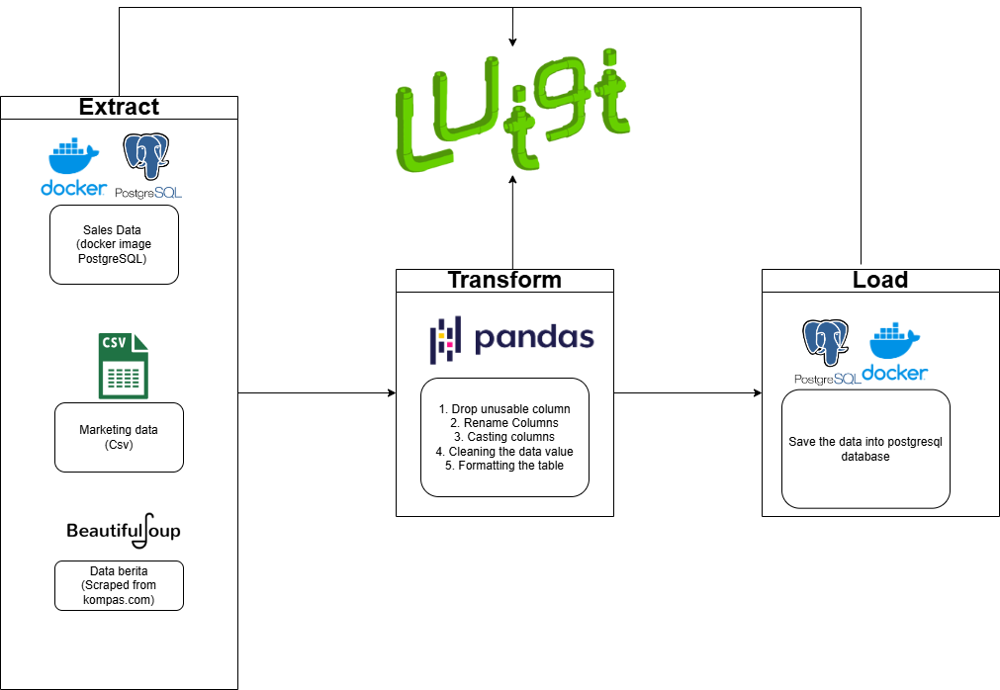

# ETL Pipeline with Luigi

## Problem

---

- Tim Sales ini melakukan analisis mengenai pengaruh harga diskon dan harga jual terhadap rating produk. Mereka sudah mempunyai data penjualan barang di Database PostgreSQL. Namun masih banyak data mereka yang kosong, tidak konsisten dan formatnya belum benar sehingga menyulitkan mereka untuk melakukan analisis.
- Tim Product ingin melakukan analisis mengenai pengaruh berat produk terhadap harga. Mereka sudah mempunyai datanya dalam bentuk csv tetapi mereka ingin data tersebut berada terpusat di database agar mudah untuk diambil. Selain itu data mereka memiliki format data yang masih berantakan, datanya tidak konsisten dan banyak missing value.
- Tim Data Scientist ingin melakukan research mengenai cara meringkas berita dengan menggunakan NLP, namun mereka belum memiliki data berita sama sekali.

## Solution

---

- Data Engineer akan membuatkan Data Pipeline dan infrastructure yang akan melakukan:
  - Extract
    - Data engineer akan melakukan scraping data berita dari website berita
    - Kemudian akan mengumpulkan semua data yang tersebar dari tim sales, tim marketing, dan data scraping.
  - Transform
    - Data yang udh terkumpul kemudian akan dicleaning masing-masing sesuai kebutuhan misalnya hapus atau imputasi data kosong, casting data, hapus kolom yang tidak digunakan dll
  - Load
    - Data-data yang sudah dicleaning akan disimpan atau dipusatkan dalam satu database warehouse yang dibuat dengan image docker postgreSQL.
    - Nantinya akan disimpan 3 table berbeda di database warehouse
- Proses data pipeline ini akan dilakukan otomasi dan penjadwalan secara berkala agar data dapat terupdate terus di database.

## Data Source

---

- Sales data:

  https://hub.docker.com/r/shandytp/amazon-sales-data-docker-db

- Marketing Data:

  https://drive.google.com/file/d/1J0Mv0TVPWv2L-So0g59GUiQJBhExPYl6/view?usp=sharing

- Scraping Kompas News:

  https://indeks.kompas.com/?site=all&page

## ETL Pipeline Solution

---

- Membuat ETL Pipeline Design:

  - Extract

    - Kumpulkan data dari berbagai sumber
    - Pahami konteks dan business dari data
    - Cek tipe data dan valuenya

  - Transform

    - Buang kolom yang tidak digunakan
    - Rename Columns
    - Casting (mengubah tipe kolom) columns
    - Cleaning setiap row data
    - Formatting the data table

  - Load

    - Simpan output dari data sales yang sudah dibersihkan ke dalam database PostgreSQL
    - Simpan output dari data Marketing yang sudah dibersihkan ke dalam database PostgreSQL
    - Simpan output dari data Scraping berita online yang sudah dibersihkan ke dalam database PostgreSQL

- Docker

  - Semua table yang sudah dibersihkan tersebut disimpan dalam database yang sama dibuat image dockerfile dan dirun sebagai container

- Membuat Scheduler

  - Otomasi semua task di atas dalam bentuk bash script
  - Jadwalkan otomasi semua task di atas dengan Crontab

- Tools
  - Python
  - Pandas
  - Luigi
  - PostgreSQL
  - Docker
  - Crontab (Scheduler)
  - BeautifulSoup (Untuk Scraping)

## ETL Pipeline Design

---



## Cara menjalankan

---

1. Jalankan dulu script di bawah untuk terhubung dengan data Sales. Data Sales ini berasal dari database PostgreSQL yang dibuat dengan Docker image.

   ```bash
   $ docker pull shandytp/amazon-sales-data-docker-db
   $ docker run -d -p 5433:5432 --name sales_data_amazon shandytp/amazon-sales-data-docker-db:latest
   ```

2. Buat Docker image dan jalankan container database warehouse (PostgreSQL) untuk menyimpan(load) output hasil cleaningnya.

   ```bash
   $ cd data-warehouse
   $ docker compose up -d
   ```

3. Gunakan Python 3.11 dan buat enviroments kemudian install package python pada requirements.txt:

   ```bash
   $ python3 -m venv "$VENV_DIRECTORY"
   $ pip install requirements.txt
   ```

4. Jalankan Script run_etl_luigi.sh pada terminal linux atau bash

   ```bash
   $ chmod +x run_etl_luigi.sh
   $ ./run_etl_luigi.sh
   ```

5. Jalankan schduler dengan membuka crontab
   ```bash
   $ crontab -e
   ```
   Kemudian di crontab scroll ke bawah dan tulis ini
   ```
    */3 * * * * /bin/bash "ETL_DIRECTORY" >> "/mnt/h/My Drive/pacmann/Intro to DE/ETL-pipeline/log/log_crontab.log" 2>&1
   ```
